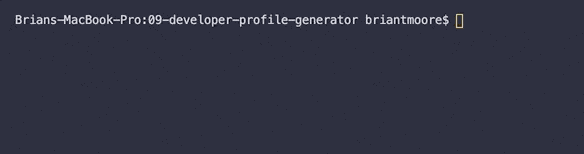
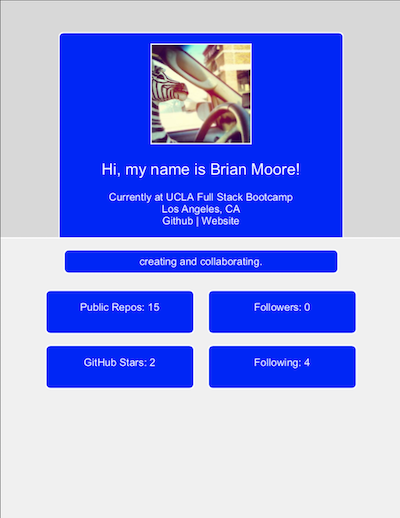

# 09-developer-profile-generator
## Unit 09 Node.js and ES6+ Homework: Developer Profile Generator

A Node.js command line interface application that generates a PDF using the user's GitHub data and favorite color. 

#### CLI  
    

#### PDF Output  
